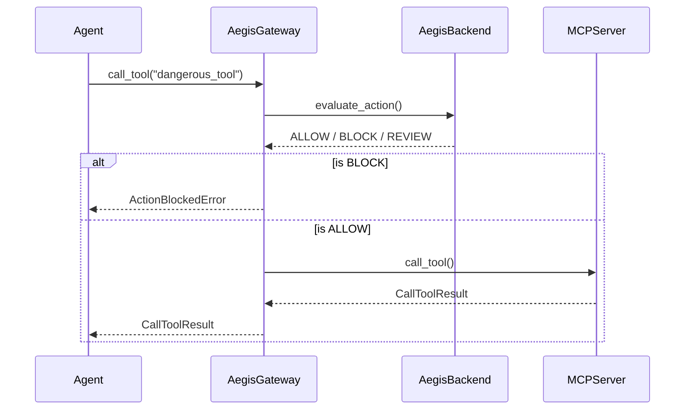

# Aegis MCP Security Gateway

The Model Context Protocol (MCP) provides a standardized way for AI agents to discover and invoke tools across local and remote servers. However, MCP currently lacks native runtime security, fine-grained access control, and auditing.

Aegis solves this by acting as a **Security Gateway** for MCP connections.

## How it Works

The Aegis SDK provides the `AegisMCPGateway` class, which wraps the standard MCP Python SDK's `ClientSession`.



By wrapping the MCP `ClientSession`, Aegis automatically intercepts every `call_tool` operation and enforces:
1. **Tool Policies**: Block specific tools from running in specific environments.
2. **Threat Detection**: Automatically detect prompt injections and malformed payloads in tool arguments.
3. **Approvals (Human-in-the-Loop)**: Pause execution and require human approval for high-risk MCP tools.
4. **Auditing**: Create an append-oriented audit log of every MCP interaction.

## Current Supported Scope

IMPLEMENTED:
- Tool-call security after server integration.
- `call_tool` interception.
- Aegis action mapping (tool identity includes the server namespace).
- Execution checks: Permission, Trust, Policy, Risk, Threat, AI Security (advisory).
- Approval workflows.
- Fail-closed execution.
- Append-oriented audit records.

LIMITATIONS:
- **Server Allowlisting / Trust**: MCP server trust/bootstrap remains external configuration. Aegis does not independently evaluate MCP server trust or provide allowlisting for which MCP servers can be connected. Server-side trust is delegated to the integration layer. Do not assume Aegis provides complete MCP server security.
- **Tool Discovery**: Tool discovery is NOT intercepted. Tools are discovered through the ordinary MCP client and only `call_tool` is protected. Full tool discovery security is not yet claimed.
- **Out of Scope APIs**: The gateway currently intercepts `call_tool`. It does not intercept MCP `read_resource` or `list_prompts` operations.
- **Tool Result Security**: Tool results returned by the MCP Server are returned directly to the Agent. They are treated as untrusted data and do not become trusted security instructions or bypass Aegis, but Aegis does not inspect tool results for malicious content (such as indirect prompt injections).

## Quick Start

Install the Aegis SDK with the MCP extra:

```bash
pip install "aegis-sdk[mcp]"
```

Wrap your MCP `ClientSession` with the `AegisMCPGateway`:

```python
import asyncio
from mcp import ClientSession
from mcp.client.stdio import stdio_client, StdioServerParameters
from aegis_sdk import AegisClient
from aegis_sdk.integrations import AegisMCPGateway

async def main():
    # 1. Initialize Aegis
    aegis_client = AegisClient(base_url="http://localhost:8000")
    
    # 2. Connect to an MCP Server
    server_params = StdioServerParameters(command="npx", args=["-y", "@modelcontextprotocol/server-filesystem", "/tmp"])
    
    async with stdio_client(server_params) as (read, write):
        async with ClientSession(read, write) as session:
            await session.initialize()
            
            # 3. Wrap with Aegis
            secure_session = AegisMCPGateway(
                session=session,
                aegis_client=aegis_client,
                agent_id="my-agent-uuid",
                session_id="my-session-uuid",
                environment="production"
            )
            
            # 4. Use securely
            try:
                result = await secure_session.call_tool("read_file", {"path": "/etc/passwd"})
                print(result)
            except Exception as e:
                print(f"Action blocked: {e}")

if __name__ == "__main__":
    asyncio.run(main())
```

## Security Posture

- **Fail-Closed**: If the Aegis backend is unreachable or returns a 500, the `AegisMCPGateway` blocks the tool execution and raises an `ActionBlockedError`.
- **Payload Redaction**: `AegisMCPGateway` supports `max_parameter_size` (default: 50KB) to prevent massive payloads from overwhelming the evaluation engine or audit logs. It also automatically redacts known sensitive parameter keys (like `password` or `api_key`).
- **Timeouts**: The gateway applies a configurable timeout (default: 2.0s) to the Aegis evaluation round-trip to ensure agents aren't permanently blocked by security latency.


