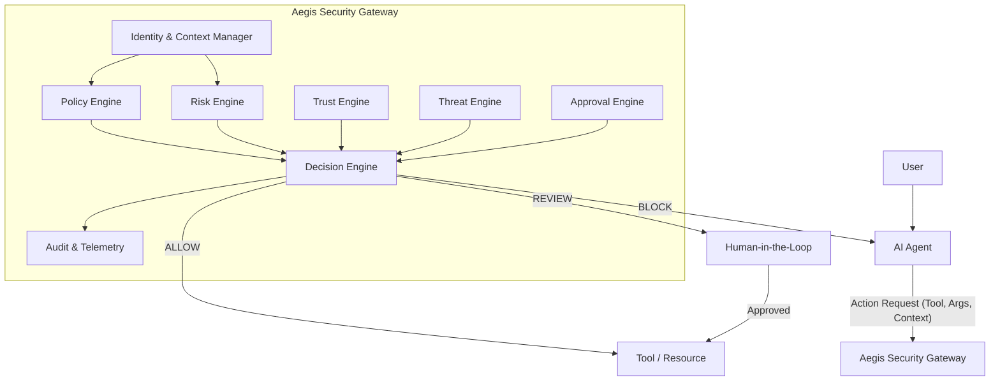

# System Architecture

## 1. High-Level Concept

Aegis is architected as an independent Security Gateway. Agents do not execute sensitive tools directly; instead, they submit an Action Request to Aegis. Aegis evaluates the request against policies, risk profiles, and threat detectors, and returns a decision (`ALLOW`, `REVIEW`, `BLOCK`). 

## 2. Core Components

### Security Gateway (API)
The primary entry point for agents to request permission to execute an action. It standardizes the incoming `Action` object and orchestrates the internal evaluation pipeline.

### Identity & Context Manager
Resolves the `User ID`, `Agent ID`, `Session ID`, and `Correlation ID`. Ensures that the action is bound to a specific, authenticated context.

### Policy & Permission Engine
A deterministic rule evaluator. It matches the requested action against a set of predefined JSON/YAML policies to explicitly ALLOW or BLOCK actions based on environment, resource, or tool configurations.

### Risk Engine
Calculates a deterministic risk score (e.g., 0-100) based on action sensitivity, environment (e.g., production vs. staging), data classification, and historical behavior.

### Trust Engine
Evaluates the trust level of the tool and resource.

### Threat Detection Engine
Acts as an orchestration layer for pluggable deterministic threat detectors (e.g., Malformed Action, Payload Anomaly, Dangerous Pattern). Maps detector findings to standard severities (LOW to CRITICAL). 

### Decision Engine
Aggregates the outputs of the Policy, Risk, and Threat engines to formulate the final, authoritative Security Decision. Resolves conflicts (e.g., Policy says ALLOW, but Threat Engine says BLOCK).

### Approval Engine (Human-in-the-Loop)
Manages the lifecycle of `REVIEW` decisions. Generates secure, time-bound, and scoped approval requests for human administrators. Ensures approvals cannot be replayed or hijacked.

### Audit & Telemetry
A high-performance, asynchronous logging system that records every evaluation, decision, and context to a structured data store. Handles payload redaction for sensitive arguments.

## 3. Extensibility
The architecture is designed to support:
- **New Threat Detectors**: Implemented as independent microservices or background tasks that the Trust Engine calls out to.
- **Framework Integrations**: The Gateway provides a standard REST API that can be consumed by SDKs for LangChain, LlamaIndex, or raw MCP clients.
